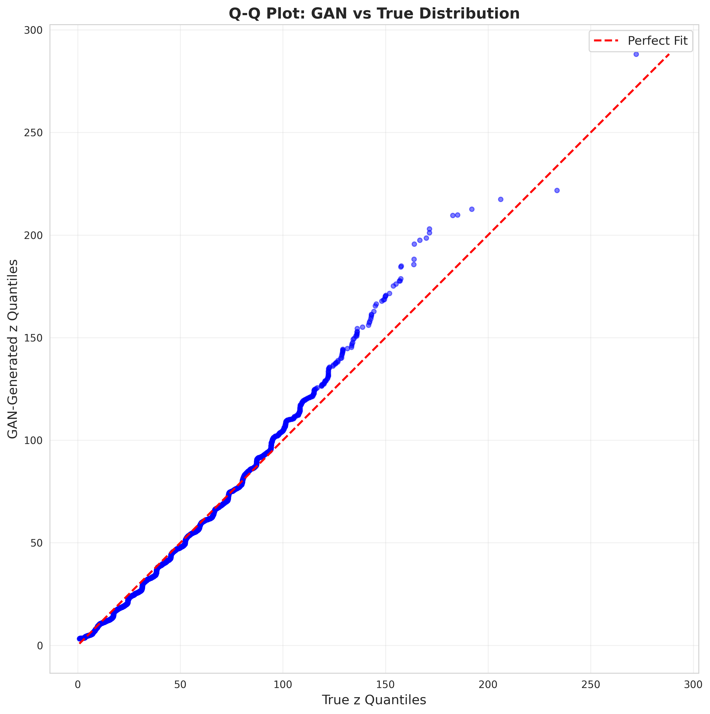
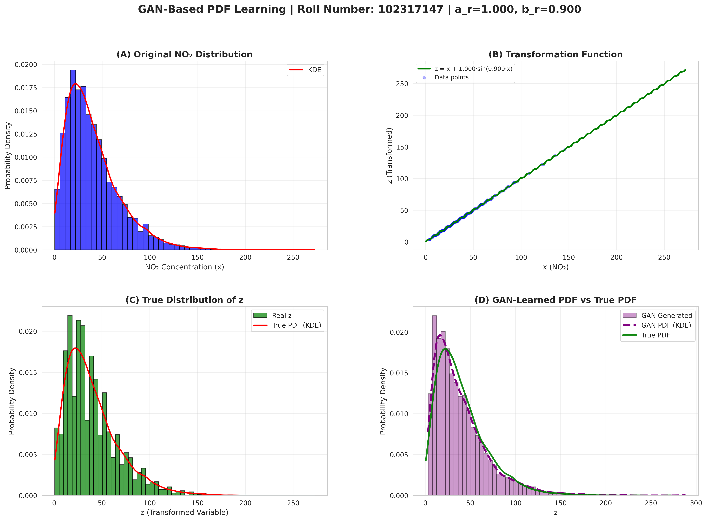

# GAN-Based Probability Density Estimation for a Nonlinearly Transformed Environmental Variable


This project investigates the capability of a Generative Adversarial Network (GAN) to learn and reproduce the probability density function (PDF) of a nonlinearly transformed environmental variable. Using real-world NO₂ concentration measurements as the underlying source distribution, a deterministic nonlinear transformation is applied, and the resulting distribution is modeled and evaluated using a trained GAN.

---

## Problem Formulation

Let the original random variable $x$ denote measured NO₂ concentration values. A nonlinear transformation of the following form is applied to obtain a derived variable $z$:

$$z = x + a \cdot \sin(b \cdot x)$$

For this experiment, the transformation parameters are set as:

| Parameter | Value |
|-----------|-------|
| $a$ | 1.000 |
| $b$ | 0.900 |

The primary objective is to train a GAN to approximate the probability distribution of $z$ and subsequently validate its fidelity against the true distribution derived directly from the transformed data.

---

## Dataset

The input data consists of real NO₂ concentration measurements collected from environmental monitoring sources. The ground truth distribution of the transformed variable $z$ is obtained by applying the defined nonlinear transformation directly to the observed data, thereby serving as the reference against which the GAN-generated distribution is evaluated.

---

## Methodology

The experimental pipeline proceeds through the following stages:

1. **Distribution Estimation** — Characterize the empirical distribution of the original variable $x$ from the measurement data.
2. **Nonlinear Transformation** — Apply the transformation $z = x + a \cdot \sin(b \cdot x)$ to obtain samples of the target variable $z$.
3. **GAN Training** — Train a Generative Adversarial Network on the transformed samples to learn the underlying distribution.
4. **Sample Generation** — Draw new synthetic samples from the trained generator.
5. **Evaluation** — Assess the quality of the learned distribution using:
   - PDF comparison via histogram overlay and Kernel Density Estimation (KDE)
   - Quantile–Quantile (Q–Q) analysis

---

## Data and Transformation

The figure below presents the original NO₂ distribution, the applied nonlinear transformation function, and the true distribution of the transformed variable $z$, providing a visual foundation for understanding the distributional shift introduced by the transformation.

---

## GAN-Learned Distribution vs. True PDF

The figure below offers a direct comparison between the histogram of GAN-generated samples, the KDE of the learned distribution, and the KDE of the true distribution of $z$. This visualization quantifies how accurately the GAN captures the underlying PDF.


---

## Quantile–Quantile (Q–Q) Analysis

A Q–Q plot is employed to assess the agreement between the quantiles of the GAN-generated samples and those of the true distribution of $z$. Proximity of plotted points to the diagonal reference line indicates strong distributional alignment between the two.



---

## Complete Experimental Summary

The figure below consolidates the full experimental workflow, presenting the original NO₂ distribution, the transformation function, the true distribution of $z$, and a comparative view of the GAN-learned versus true distribution in a unified layout.



---

## Key Findings

- The GAN successfully captures the overall shape and structure of the transformed distribution.
- The central region of the distribution is reproduced with high fidelity.
- Minor deviations are observed in the tail regions, which is characteristic of GAN-based density estimation under limited training data.
- The Q–Q plot confirms strong quantile-level agreement across the majority of the distribution, with marginal discrepancies at extreme values.

---

## Repository Structure

```
├── Probability Density Functions using data only-code.ipynb   # Main experimental notebook
├── data_transformation.png                                     # Data and transformation visualization
├── pdf_comparison.png                                          # GAN vs true PDF comparison
├── qq_plot.png                                                 # Q–Q plot
└── complete_analysis.png                                       # Full experimental summary figure
```

The notebook encompasses the complete pipeline including data preprocessing, nonlinear transformation, GAN architecture and training, and all evaluation visualizations.

---

## Reproducing the Results

1. Open the main notebook:
   ```
   Probability Density Functions using data only-code.ipynb
   ```
2. Execute all cells sequentially to reproduce the following:
   - Data loading and preprocessing
   - Generation of transformed samples
   - GAN training
   - Evaluation figures and distribution comparisons

---

## Learning Outcomes

This project serves as a practical demonstration of the following concepts:

- Application of GANs to one-dimensional probability density estimation
- The effect of nonlinear transformations on the shape and characteristics of a distribution
- The use of PDF overlays and Q–Q plots as rigorous tools for evaluating generative models
